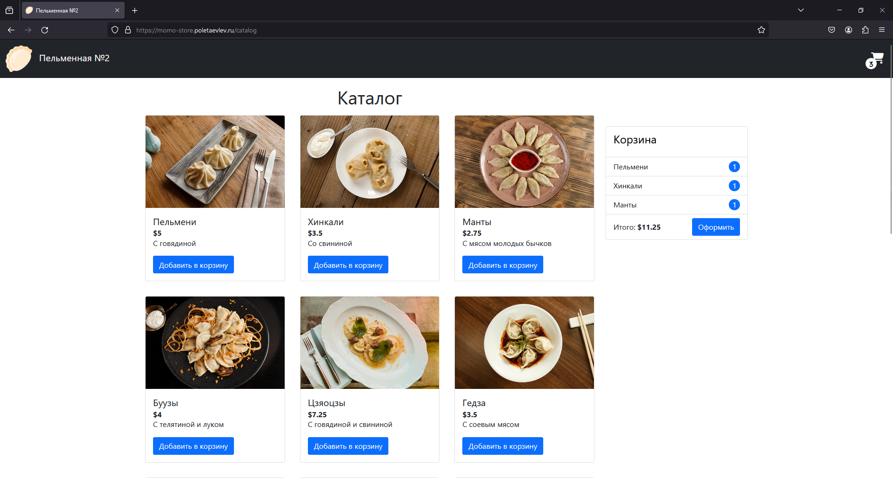
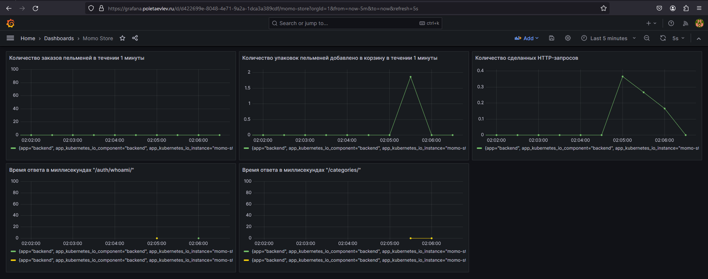

# Проект - Пельменная 2




### Цель проекта

```
Применить знания полученные в процессе обучения.
Получить полностью рабочее приложение интернет магазина "Пельменная", развернутое в Яндекс облаке с
использованием сервиса Yandex Managed Service for Kubernetes.
```
### Устройство репозитория

**Проэкт momo-store-infrastructure:**

​	**terraform** : манифесты для развертывания Kubernetes Yandex Managed Service	

```
provider.tf - Указан Provider и расположение авторизованного ключа

variables.tf - Переменные используемые в деплое инфраструктуры

versions.tf - Настройки провайдера и S3 Bucket

ya_kuber_cl_kms.tf - Настройки KMS для шифрования важной информации, такой как пароли, OAuth-токены и SSH-ключи

ya_kuber_cl_main.tf - Основная конфигурация инфраструктуры для Master

ya_kuber_cl_roles.tf - Сервисный аккаунт для работы кластера kubernetes и роли для него

ya_kuber_cl_sg_main.tf - Правила группы безопасности обеспечивают базовую работоспособность кластера

ya_kuber_cl_sg_master_api.tf - Правила группы безопасности разрешают доступ к API Kubernetes из интернета

ya_kuber_cl_sg_nodes_ssh.tf - Правила группы безопасности разрешают подключение к узлам кластера по SSH

ya_kuber_cl_sg_public_services.tf - Правила группы безопасности разрешают подключение к сервисам из интернета

ya_kuber_cl_vpc.tf - Сеть для kubernetes кластера

ya_kuber_ng_worker.tf - Worker ноды кластера kubernetes
```

**Проект momo-store-application:**

​	**backend** : Исходный код backend приложения momo-store, Dockerfile, CI/CD pipeline

```
.gitlab-ci.yml - CI/CD pipeline выполняющий сборку приложения, тестирование кода и публикацию в виде Docker image в Gitlab Container Registry

Dockerfile - Инструкция сборки приложения с помощью Docker
```

​	**frontend** : Исходный код frontend приложения momo-store, Dockerfile, CI/CD pipeline

```
.gitlab-ci.yml - CI/CD pipeline выполняющий сборку приложения, тестирование кода и публикацию в виде Docker image в Gitlab Container Registry

Dockerfile - Инструкция сборки приложения с помощью Docker
```

​	**helm/ingress** : Конфигурация Ingress Kubernetes

​	**helm/momo-store-chart** : Helm-чарты приложения momo-store

​	**helm/prometheus-chart** : Конфигурация для мониторинга стека Prometheus/Grafana/Alertmanager

​	**README.md** - Файл с описанием проекта в формате Mark Down

​	**readme-pics** - Директория с изображениями использованными в README.md


## 1. Развертывание инфраструктуры

```
Все манипуляции производятся в личном облаке Yandex Cloud
В качестве инфраструктуры для деплоя "Пельменной" был выбран Yandex Managed Service for Kubernetes
```
### Подготовка

Перед разверткой инфраструктуры необходимо выполнить следующие подготовительные работы:

1. Создать Организацию
2. Создать Директорию
3. Создать S3 Бакет для хранения состояния terraform
4. Создать сервисный аккаунт с ролью editor на каталог
5. Создать статический ключ доступа для S3 Бакета, для сервисного аккаунта
6. Установить и настроить yandex client для работы под сервисным аккаунтом

### Создание кластера Managed Service for Kubernetes

Создание кластера Kubernetes состоит из двух пунктов:

Первый - Создание самого кластера

Второй - создание группы узлов (worker-nodes)

#### Описание создания кластера Managed Service for Kubernetes

```
Для создания кластера используется Terraform.
Разворачиваемая версия k8s - 1.27
Используется один публичный IP адрес для последующего доступа к кластеру по API (kubectl)
```
**Шаги развертки кластера:**

1. Создается сервисный аккаунт "myaccount"
2. Назначаются роли на этот аккаунт:
    1. k8s.clusters.agent
    2. load-balancer.admin
    3. vpc.publicAdmin
    4. container-registry.images.puller
    5. viewer
    6. editor
3. Создаются ключ шифрования важной информации, такой как пароли, SSH-ключи
4. Создаются группы безопасности для взаимодействия компонентов кластера между собой и с внешним миром
5. Создается vpc сеть "mynet"
6. Создается подсеть "mysubnet"
7. Создается кластер Managed Service for Kubernetes. При создании кластера происходят такие события:
    1. Назначаются группы безопасности
    2. Назначается сервисный аккаунт для управления кластером
    3. Назначается сервисный аккаунт для управления нодами


4. Указываются зависимости процедуры развертки кластера от других ресурсов

#### Описание создания группы узлов

```
Создаются виртуальные машины с минимальным количеством ресурсов
Количество нод - 2
Используются прерываемые виртуальные машины
```
**Шаги развертки группы узлов:**

1. Разворачиваются прерываемые виртуальные машины
2. В качестве container runtime используется containerd
3. Назначаются группы безопасности

#### Запуск выполнения кода terraform по развертке кластера Kubernetes

Для развертки кластера необходимо перейти в директорию momo-store-infrastructure/terraform и выполнить команду:

Инициализация terraform:

```
terraform init
```

Развертка кластера:

```
terraform apply

```


### Итог выполнения кода terraform по развертке кластера Kubernetes

```
Если при развертке кластера k8s всё пройдет успешно, terraform отобразит ID созданного кластера, который
понадобится в следующем шаге.
После выполнения кода terraform получим рабочий и готовый к подключению по API кластер Managed Service
for Kubernetes.
```
## 2. Подготовка кластера Kubernetes к деплою приложения

## пельменной

После развертки кластера Kubernetes необходимо провести ряд настроек в кластере для успешного деплоя
пельменной.

Для успешного выполнения действий по подготовке кластера к деплою приложения понадобится ПО:

1. **yc** - интерфейс командной строки для работы с Облаком Яндекса (Потребуется настройка для работы с
    облаком. Инструкция)
    
2. **kubectl** - инструмент командной строки для управления кластером Kubernetes

3. **jq** - Утилита для анализа и обработки JSON

    

Выбор устройства на котором предполагается выполнять действия по подготовке кластера к деплою приложения
пельменной ложится на инфраструктурного инженера.

### Создание статического файла конфигурации

1. Узнайте уникальный идентификатор кластера Managed Service for Kubernetes:

```
yc managed-kubernetes cluster list
```

Результат:

```
+----------------------+------+---------------------+---------+---------+-----------------------+-------------------+
|          ID          | NAME |     CREATED AT      | HEALTH  | STATUS  |   EXTERNAL ENDPOINT   | INTERNAL ENDPOINT |
+----------------------+------+---------------------+---------+---------+-----------------------+-------------------+
| catpoq29l75dkhm8j9rb |      | 2023-12-15 01:44:20 | HEALTHY | RUNNING | https://51.250.92.135 | https://10.1.0.28 |
+----------------------+------+---------------------+---------+---------+-----------------------+-------------------+
```

2. Запишите уникальный идентификатор кластера Managed Service for Kubernetes в переменную:

```
CLUSTER_ID=catpoq29l75dkhm8j9rb
```

3. Подготовьте сертификат кластера:

```
mkdir -p ./config-kubectl && \
cd ./config-kubectl && \
yc managed-kubernetes cluster get --id $CLUSTER_ID --format json | \
  jq -r .master.master_auth.cluster_ca_certificate | \
  awk '{gsub(/\\n/,"\n")}1' > ~/config-kubectl/ca.pem && \
  var_crt_k8s=$(base64 -w 0 ca.pem)
```

4. Создайте объект ServiceAccount

```
cat << EOF > sa.yaml
apiVersion: v1
kind: ServiceAccount
metadata:
  name: admin-user
  namespace: kube-system
---
apiVersion: rbac.authorization.k8s.io/v1
kind: ClusterRoleBinding
metadata:
  name: admin-user
roleRef:
  apiGroup: rbac.authorization.k8s.io
  kind: ClusterRole
  name: cluster-admin
subjects:
- kind: ServiceAccount
  name: admin-user
  namespace: kube-system
---
apiVersion: v1
kind: Secret
type: kubernetes.io/service-account-token
metadata:
  name: admin-user-token
  namespace: kube-system
  annotations:
    kubernetes.io/service-account.name: "admin-user"
EOF
```

```
kubectl create -f sa.yaml
```

5. Подготовьте токен объекта ServiceAccount

```
SA_TOKEN=$(kubectl -n kube-system get secret $(kubectl -n kube-system get secret | grep admin-user-token | awk '{print $1}') -o json | jq -r .data.token | base64 --d)
```

6. Получите IP-адрес кластера

```
MASTER_ENDPOINT=$(yc managed-kubernetes cluster get --id $CLUSTER_ID \
  --format json | \
  jq -r .master.endpoints.external_v4_endpoint)
```

7. Дополните файл конфигурации

```
kubectl config set-cluster sa-test2 \
  --certificate-authority-data=$var_crt_k8s \
  --server=$MASTER_ENDPOINT \
  --kubeconfig=config
```

8. Добавьте информацию о токене для admin-user в файл конфигурации

```
kubectl config set-credentials admin-user \
  --token=$SA_TOKEN \
  --kubeconfig=config
```

9. Добавьте информацию о контексте в файл конфигурации

```
kubectl config set-context default \
  --cluster=sa-test2 \
  --user=admin-user \
  --kubeconfig=config
```

10. Сделайте замену параметров как в приведенном ниже конфиге. 

    **certificate-authority** замените на **certificate-authority-data**

    **current-context: ""** замените на **current-context: "default"**

```
apiVersion: v1
clusters:
- cluster:
    certificate-authority-data: LS0tLS1CRUdJTiBDRVJUSUZJQ0FURS0tLS0tCk1JSUM1ekNDQWMrZ*******************************
    server: https://51.250.92.135
  name: sa-test2
contexts:
- context:
    cluster: sa-test2
    user: admin-user
  name: default
current-context: "default"
kind: Config
preferences: {}
users:
- name: admin-user
  user:
    token: eyJhbGciOiJSUzI1NiIsImtpZCI6InU1ZjdMd1VpRTVsZmFNMVloWVJYRH**********************************************

```

11. Далее этот config может быть помещён на машине с установленным kubectl в папку  .kube  и уже можно работать с kubernetes кластером без использования yc. Данная конфигурация была сконвертирована в base64 и установлена в переменные Gitlab с названием KUBECONFIG_FILE для использования в CI/CD pipeline Gitlab.


### Установка Ingress NGINX Controler

1. [Установите менеджер пакетов Kubernetes Helm](https://helm.sh/ru/docs/intro/install).
2. Для установки [Helm-чарта](https://helm.sh/docs/topics/charts/) с Ingress-контроллером NGINX выполните команду:

```
helm repo add ingress-nginx https://kubernetes.github.io/ingress-nginx && \
helm repo update && \
helm install ingress-nginx ingress-nginx/ingress-nginx
```

### Настройте DNS-запись для Ingress-контроллера

Узнайте IP-адрес Ingress-контроллера (значение в колонке EXTERNAL-IP):

После установки ingress-nginx-Controller, необходимо получить публичный IP адрес Ingress контроллера и создать A
запись в DNS.

```
kubectl get svc | grep ingress
```

Результат:

```
NAME                                      TYPE           CLUSTER-IP      EXTERNAL-IP       PORT(S)                      AGE
ingress-nginx-controller                  LoadBalancer   10.96.255.66    158.160.129.140   80:30223/TCP,443:32637/TCP   3d7h
```


## 3. Развертывание приложения

```
Для развертывания приложения используются CI/CD возможности GitLab
Артефакты сборки версионируются и хранятся в GitLab Container Registry
Helm-чарты публикуются и версионируются в Nexus
```
### Описание окружения проекта

#### Переменные

| Имя переменной                            | Назначение                                                   |
| ----------------------------------------- | ------------------------------------------------------------ |
| KUBECONFIG_FILE                           | Статический конфигурационный файл для подключения к кластеру k8s |
| NEXUS_PASSWORD                            | Пароль от Nexus репозитория                                  |
| NEXUS_REPO_HELM                           | URL Nexus репозитория для Helm чартов                        |
| NEXUS_USER                                | Имя пользователя от Nexus репозитория                        |
| SECRETS_HELM_ALL                          | Секреты Helm чарта Пельменной                                |
| SONARQUBE_HOST_URL                        | URL сервера SONARQUBE                                        |
| SONARQUBE_LOGIN_TOKEN_MOMO_STORE_BACKEND  | Token для backend в SONARQUBE                                |
| SONARQUBE_LOGIN_TOKEN_MOMO_STORE_FRONTEND | Token для frontend в SONARQUBE                               |
| SONARQUBE_PROJECT_KEY_MOMO_STORE_BACKEND  | Key для backend в SONARQUBE                                  |
| SONARQUBE_PROJECT_KEY_MOMO_STORE_FRONTEND | Key для frontend в SONARQUBE                                 |
| TLS_SECRET_GRAFANA                        | Secret Kubernetes с SSL для Grafana                          |
| TLS_SECRET_MOMO_STORE                     | Secret Kubernetes с SSL для Momo-store                       |


#### CI/CD Пайплайны

В проекте **momo-store-application** присутствует один общий пайплайн в корне проекта и три downstreem-пайплайна в директориях frontend, 
backend и helm.

**Pipeline в корне проекта momo-store-application**

- Запускает pipeline в директории backend при изменениях в данной директории
- Запускает pipeline в директории frontend при изменениях в данной директории
- Запускает pipeline в директории helm при изменениях в директории /helm/momo-store-chart


**Pipeline в директории backend**

| Стадии  | Действия                                                     |
| ------- | ------------------------------------------------------------ |
| build   | Сборка backend приложения и загрузка Docker образа в репозиторий Gitlab |
| test    | Тестирование приложения backend встроенными в GitLab тестами SAST и тестирование с использованием SonarQube |
| release | Скачивается после прохождения тестов загруженный Dосker образ backend на стадии build, присваивается тэг latest и загружается обратно уже с тэгом latest |


**Pipeline в директории frontend**

| Стадии  | Действия                                                     |
| ------- | ------------------------------------------------------------ |
| build   | Сборка frontend приложения и загрузка Docker образа в репозиторий Gitlab |
| test    | Тестирование приложения frontend встроенными в GitLab тестами SAST и тестирование с использованием SonarQube |
| release | Скачивается после прохождения тестов загруженный Dосker образ frontend на стадии build, присваивается тэг latest и загружается обратно уже с тэгом latest |


**Pipeline в директории helm**

| Стадии  | Действия                                                     |
| ------- | ------------------------------------------------------------ |
| release | Дополняет в чарт приложения секрет для авторизации в Docker Registry Gitlab, упаковывает и публикует его в Nexus |
| deploy  | Деплоит чарт в кластере Kubernetes, и если были изменения в директории конфигурации для Ingress (helm/ingress) до применяет изменённую конфигурацию Ingress |


#### Итог сборки и публикации приложения пельменной

После отработки 3 пайплайнов мы получаем полностью рабочее приложение запущенное в кластере Kubernetes, доступное для подключения по протоколу HTTPS
URL Пельменной: https://momo-store.poletaevlev.ru


## Мониторинг

Для отслеживания состояния бизнес-метрик Пельменной настроены Prometheus и Grafana. Создан Dashboard "Momo Store"

URL Grafana: https://grafana.poletaevlev.ru

```
Логин: admin
Пароль: i798Fs2f
```




```
Полетаев Л. А. 2023 г.
```